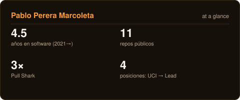
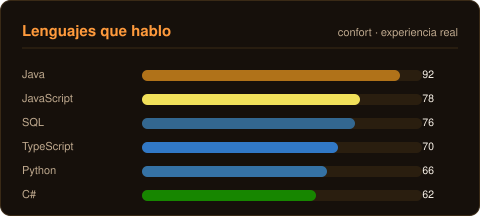

<!-- BANNER - pablocean terminal live profile. Generated by scripts/banner.py. -->
<picture>
  <source media="(prefers-color-scheme: dark)"  srcset="assets/banner-dark.svg">
  <source media="(prefers-color-scheme: light)" srcset="assets/banner-light.svg">
  
</picture>

 

<!-- NAME / TAGLINE - animated typing -->

 
 

 

<!-- SOCIALS — LinkedIn stays brand blue (glyph vanishes on custom fills). The rest are themed. -->
&nbsp;&nbsp;
&nbsp;&nbsp;
&nbsp;&nbsp;

 

---

## hola, soy pablo

Hi, I'm **Pablo**, a backend engineer and full-stack developer from **Havana, Cuba 🇨🇺**. I live in the JVM — Java and Spring Boot are home — but I refuse to stay there. I build real-time, secure, high-availability systems, and I'm a little obsessed with making them feel effortless.

- 🏗️ **Lead Software Engineer at [535 Pont Culturel](https://pablopereramarcoletacv.vercel.app)**: leading the architecture and delivery of full-stack products, mentoring engineers, and keeping the Scrum engine honest.
- 🧩 **Backend heart**: Java · Spring Boot · WebFlux, reactive programming, WebSockets for real-time bidirectional communication, and enterprise security baked in from day one.
- 🤖 **AI, but shipped**: Spring AI in production workflows, plus RAG conversational agents with LangChain + Ollama over custom knowledge bases.
- 📱 **Full-stack reach**: React, React Native, Vite, Tailwind — interfaces that respect the APIs behind them.
- 🏛️ **Past life**: security-first systems at VIQSystems, national infrastructure at the National Cultural Heritage Council, and my start at UCI.
- 🌱 **My mission:** ship software that stays up under load, and help the next generation of Cuban devs get there too.
- 💬 Talk to me about **Java, microservices, reactive systems, or coffee from the Malecón** — you'll have my full attention.

## el stack

---

## señales

<table>
<tr>
<td width="50%" align="center" valign="middle">

<!-- Self-rated radar - edit assets/skills.json, the workflow redraws it -->
<picture>
  <source media="(prefers-color-scheme: dark)"  srcset="assets/radar-skills-dark.svg">
  <source media="(prefers-color-scheme: light)" srcset="assets/radar-skills-light.svg">
  
</picture>

</td>
<td width="50%" align="center" valign="middle">

<!-- Hand-authored language radar - edit assets/langs.json, the workflow redraws it -->
<picture>
  <source media="(prefers-color-scheme: dark)"  srcset="assets/radar-langs-dark.svg">
  <source media="(prefers-color-scheme: light)" srcset="assets/radar-langs-light.svg">
  
</picture>

</td>
</tr>
</table>

---

## números que importan

<!-- Self-hosted. Deliberately NOT github-readme-stats / streak-stats / trophy:
     shared public instances that go down and take the section with them, and
     raw public counters that would undersell what's private. Data is honest,
     hand-edited in assets/highlights.json + assets/langbars.json. -->
<picture>
  <source media="(prefers-color-scheme: dark)"  srcset="assets/card-highlights-dark.svg">
  <source media="(prefers-color-scheme: light)" srcset="assets/card-highlights-light.svg">
  
</picture>

 

<picture>
  <source media="(prefers-color-scheme: dark)"  srcset="assets/card-langs-dark.svg">
  <source media="(prefers-color-scheme: light)" srcset="assets/card-langs-light.svg">
  
</picture>

---

` echo "hecho en La Habana · pablocean" `

